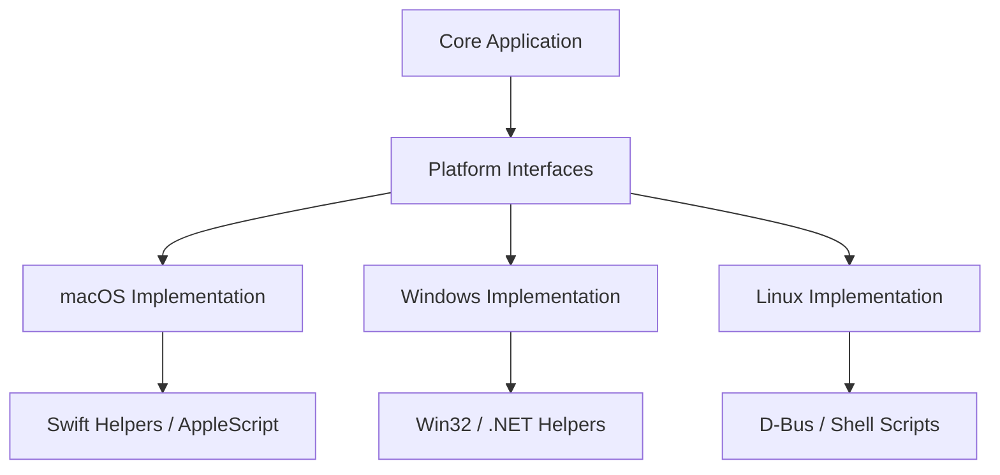

# Platform Abstraction Architecture

SuperCmd uses a **Platform Abstraction Layer** to isolate operating system-specific logic from the core application. This ensures that features like application discovery, speech recognition, and window management can be implemented for different platforms (macOS, Windows, Linux) without modifying the main application code.

## Architecture Overview

The architecture consists of three main layers:

1.  **Core Application**: The main process (`src/main/main.ts`, `src/main/commands.ts`, etc.) which interacts only with platform-agnostic interfaces.
2.  **Platform Abstraction Layer (PAL)**: A set of TypeScript interfaces (`src/platform/interfaces/`) that define the required OS capabilities.
3.  **Platform Implementations**: Concrete implementations for each supported OS (`src/platform/mac/`, `src/platform/windows/`, `src/platform/linux/`).

## Directory Structure

- `src/platform/`
  - `index.ts`: Re-exports the active platform implementation based on the `TARGET_OS` environment variable.
  - `interfaces/`: Contains the TypeScript interface definitions for each capability (e.g., `clipboard.ts`, `speech.ts`).
  - `mac/`: The primary implementation for macOS.
  - `windows/`: Stubs and skeleton for future Windows support.
  - `linux/`: Stubs and skeleton for future Linux support.
- `src/native/`
  - `mac/`: Contains the Swift source code for macOS-specific native helpers.

## Build-Time Platform Resolution

The specific platform implementation is resolved at **build time** using Vite aliasing. The `TARGET_OS` environment variable dictates which platform directory is mapped to the `@platform` alias.

- **mac**: Map `@platform` to `src/platform/mac/`
- **windows**: Map `@platform` to `src/platform/windows/`
- **linux**: Map `@platform` to `src/platform/linux/`

This approach ensures that only relevant code is included in the final bundle, optimizing performance and security.

## Key Interfaces

### `CommandsDiscoveryAPI`
Handles the discovery of installed applications and system settings.
- `discoverApplications()`: Returns a list of installed apps.
- `discoverSystemSettings()`: Returns a list of system preference panes.
- `getAppIcon()`: Extracts the icon for a given application bundle.

### `SpeechAPI`
Manages native speech-to-text (STT) and text-to-speech (TTS).
- `startNativeTranscription()`: Begins live audio-to-text conversion.
- `ensureSpeechRecognitionAccess()`: Requests OS-level permissions for speech and microphone.

### `WindowManagerAPI`
Provides window manipulation capabilities.
- `setWindowBounds()`: Moves and resizes application windows.
- `executeWindowAdjustByAction()`: Performs complex window adjustments (e.g., snapping, moving between displays).

### `AccessibilityAPI`
Enables interaction with other applications' UI elements.
- `getSelectedText()`: Retrieves the currently selected text in the active app.
- `checkInputMonitoringAccess()`: Verifies if SuperCmd has permission to monitor system-wide input.

## On-Demand Compilation

For development convenience, many macOS native helpers (`color-picker`, `speech-recognizer`, etc.) feature **on-demand compilation**. If a required native binary is missing from `dist/native/`, the platform implementation will attempt to compile it from source using `swiftc` automatically.

## Future Platforms

To add support for a new platform (e.g., Windows):
1.  Navigate to `src/platform/windows/`.
2.  Implement the required interfaces by replacing the default error-throwing stubs.
3.  Place any required native source code (e.g., C# or C++) in `src/native/windows/`.
4.  Update the build scripts to handle native compilation for the new platform.
